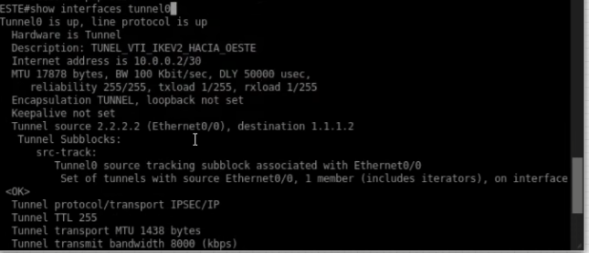
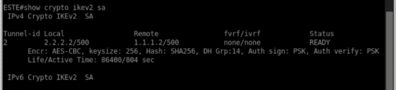
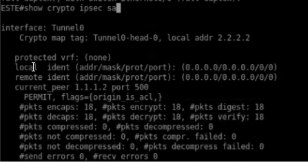
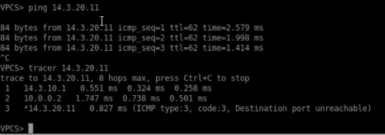

<h1>Instituto Tecnológico de Las Américas (ITLA)</h1>
  
<h2>Configuración y Verificación de VPN Site-to-Site Basada en Enrutamiento (IPSec IKEv2 VTI)</h2>

Documentación Técnica Profesional — Práctica 5 (Semana 6)

   

<strong>Estudiante:</strong> Alan Daniel Garcia Mendez 
<strong>Matrícula:</strong> 2025-1403 
<strong>Carrera:</strong> Seguridad Informática 
<strong>Asignatura:</strong> Seguridad de Redes 
<strong>Docente:</strong> Jonathan Esteban Rondon Corniel 
<strong>Fecha de Entrega:</strong> 2 de julio de 2026 
<strong>Video de Exposición:</strong> <a href="https://youtu.be/y8I0rjUbP7E">https://youtu.be/y8I0rjUbP7E</a> 
<strong>Repositorio de GitHub:</strong> <a href="https://github.com/imAlanG16/05_ipsec_ikev2_route_s2s">https://github.com/imAlanG16/05_ipsec_ikev2_route_s2s</a>

## Objetivo de la VPN
El objetivo de este laboratorio es implementar una VPN de tipo Site-to-Site basada en enrutamiento (Route-based) utilizando la interfaz de túnel virtual (Virtual Tunnel Interface - VTI) con la versión del protocolo IKEv2. Este enfoque encapsula de forma nativa todo el tráfico de Capa 3 que se envíe hacia la interfaz lógica `Tunnel0` y lo protege mediante IPSec, combinando las ventajas del enrutamiento directo con las prestaciones de seguridad de IKEv2 (resiliencia de negociación, rekeying eficiente y menor carga transaccional).

## Topología de Red y Direccionamiento
La infraestructura física conecta las sucursales Oeste y Este mediante el router ISP intermedio. Una subred de túnel lógica (`10.0.0.0/30`) se asigna a los extremos virtuales del enlace.

  
  
Topología física Site-to-Site utilizada en la práctica

El direccionamiento de las interfaces físicas y lógicas del laboratorio se detalla a continuación:

| Dispositivo / Rol | Interfaz | Dirección IP / Subred | Descripción |
| :--- | :--- | :--- | :--- |
| **Router OESTE (Peer 1)** | Ethernet0/0 | `1.1.1.2/30` | WAN física hacia ISP |
| | Ethernet0/1 | `14.3.10.1/24` | LAN interna corporativa |
| | Tunnel0 | `10.0.0.1/30` | Interfaz lógica Tunnel VTI |
| **Router ESTE (Peer 2)** | Ethernet0/0 | `2.2.2.2/30` | WAN física hacia ISP |
| | Ethernet0/1 | `14.3.20.1/24` | LAN interna corporativa |
| | Tunnel0 | `10.0.0.2/30` | Interfaz lógica Tunnel VTI |

## Parámetros Criptográficos Utilizados
La seguridad criptográfica de las interfaces VTI se define en base a los siguientes parámetros:

| Fase | Parámetro | Valor Configurado |
| :--- | :--- | :--- |
| **Fase 1 (IKEv2)** | Configuración | IKEv2 Proposal (`PROP_IKEV2`) |
| **Fase 1** | Algoritmo de Cifrado | AES-CBC-256 |
| **Fase 1** | Función de Integridad | SHA-256 |
| **Fase 1** | Intercambio de Claves | Group 14 (Diffie-Hellman 2048-bit) |
| **Fase 1** | Llavero / PSK | `KEYRING_LOCAL` / `CISCO123` |
| **Fase 1** | Perfil IKEv2 | `PERFIL_VTI_IKEV2` |
| **Fase 2 (IPSec)** | Transform-Set | `TS_VTI_IKEV2` (`esp-aes 256 esp-sha256-hmac`) |
| **Fase 2** | Modo de Operación | Tunnel Mode (`mode tunnel`) |
| **Fase 2** | Asociación | Perfil IPSec (`IPSEC_PROF_VTI`) aplicado directamente al túnel |

## Explicación de la Configuración y Scripts
La configuración en IOS asocia el transform-set IPSec y el perfil de IKEv2 dentro de un perfil unificado de IPSec (`crypto ipsec profile IPSEC_PROF_VTI`). Este perfil de seguridad protege directamente a la interfaz Tunnel0 mediante la directiva `tunnel protection ipsec profile IPSEC_PROF_VTI`. El tráfico dirigido a las redes LAN remotas se enruta mediante una ruta estática simple (`ip route 14.3.20.0 255.255.255.0 10.0.0.2` en Oeste) que direcciona las tramas de manera nativa por la interfaz virtual Tunnel0.

Los scripts de configuración se encuentran guardados en la carpeta de recursos de este entregable: [script_configuracion.txt](resources/script_configuracion.txt).

## Verificación de Funcionamiento

### 1. Estado y Operatividad del Túnel Virtual (Tunnel0)
Para confirmar la creación de la interfaz lógica VTI y su vinculación, se ejecuta el comando `show interfaces tunnel0` en el router `ESTE`. La salida demuestra que el túnel se encuentra activo y su protocolo de línea en funcionamiento (**`up / up`**). 

Se detalla la dirección IP virtual asignada **`10.0.0.2/30`**, la descripción del enlace (`TUNEL_VTI_IKEV2_HACIA_OESTE`), el origen/destino físico (`2.2.2.2` ➔ `1.1.1.2`), y la encapsulación segura: **`Tunnel protocol/transport IPSEC/IP`**.

  
  
Detalles lógicos y de direccionamiento de Tunnel0 en el extremo de ESTE bajo IKEv2

### 2. Estado de la Negociación IKEv2 SA (Fase 1)
La comprobación del canal seguro de control en IKEv2 se realiza mediante el comando `show crypto ikev2 sa` en el router `ESTE`. La salida registra las asociaciones activas establecidas exitosamente hacia el peer público remoto `1.1.1.2` (WAN de Oeste). 

La SA se encuentra en estado estable **`READY`**, y reporta los algoritmos configurados: **`Encr: AES-CBC, keysize: 256, Hash: SHA256, DH Grp:14, Auth sign/verify: PSK`**.

  
  
Estado IKEv2 SA en el router ESTE validando la sesión de control segura y activa

### 3. Asociación de Seguridad IPSec en el VTI (Fase 2)
Al ejecutar el comando `show crypto ipsec sa` en el router `ESTE`, se verifica el estado criptográfico de la interfaz Tunnel0. En este diseño VTI IKEv2, al igual que en VTI IKEv1, las identidades de red protegidas se definen de manera global como **`(0.0.0.0/0.0.0.0/0/0)`** para origen y destino, delegando el filtrado de seguridad a la tabla de enrutamiento.

Los contadores de tráfico confirman el encriptado y desencriptado correcto de datos:
* **`#pkts encaps: 18`** y **`#pkts encrypt: 18`**
* **`#pkts decaps: 18`** y **`#pkts decrypt: 18`**

Esto comprueba que 18 tramas de datos han sido cifradas y descifradas a través del VTI de forma exitosa.

  
  
Estadísticas de la SA IPSec de Tunnel0 en ESTE bajo IKEv2

### 4. Prueba de Conectividad y Trazado de Ruta LAN a LAN (Traceroute VTI)
La verificación de conectividad de extremo a extremo se realiza desde la consola del cliente VPCS en el extremo Oeste. Al enviar pings hacia el host remoto en la LAN Este (`14.3.20.11`), se obtiene una conectividad exitosa con **0% de pérdida**.

Además, al trazar la ruta mediante el comando `tracer 14.3.20.11`, se comprueba el flujo de enrutamiento:
1. El primer salto se dirige al gateway de la LAN local `14.3.10.1` (interfaz del router Oeste).
2. El segundo salto transita directamente a través del extremo virtual del túnel remoto **`10.0.0.2`** (interfaz Tunnel0 del router Este). Esto demuestra de forma irrefutable que el tráfico LAN es enrutado y protegido por la VTI de IKEv2.
3. El tercer salto alcanza al host destino `14.3.20.11` a través de la LAN de Este.

  
  
Prueba de conectividad desde VPCS validando el paso por el extremo de túnel virtual 10.0.0.2

